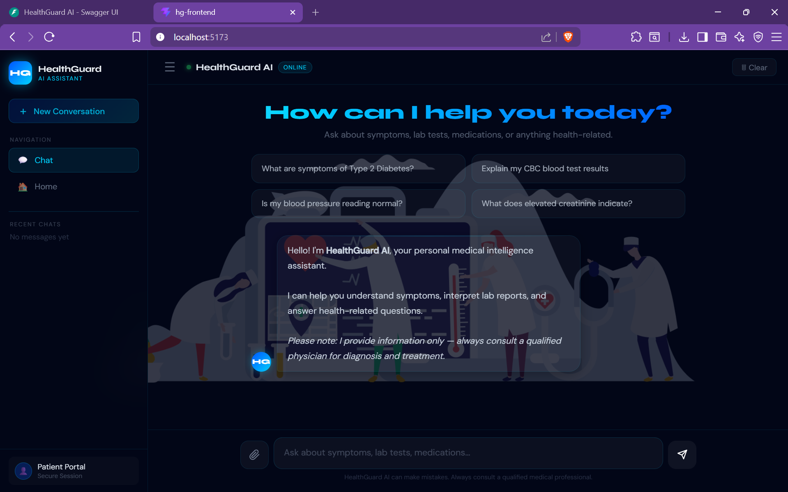
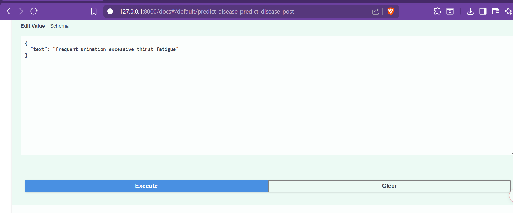
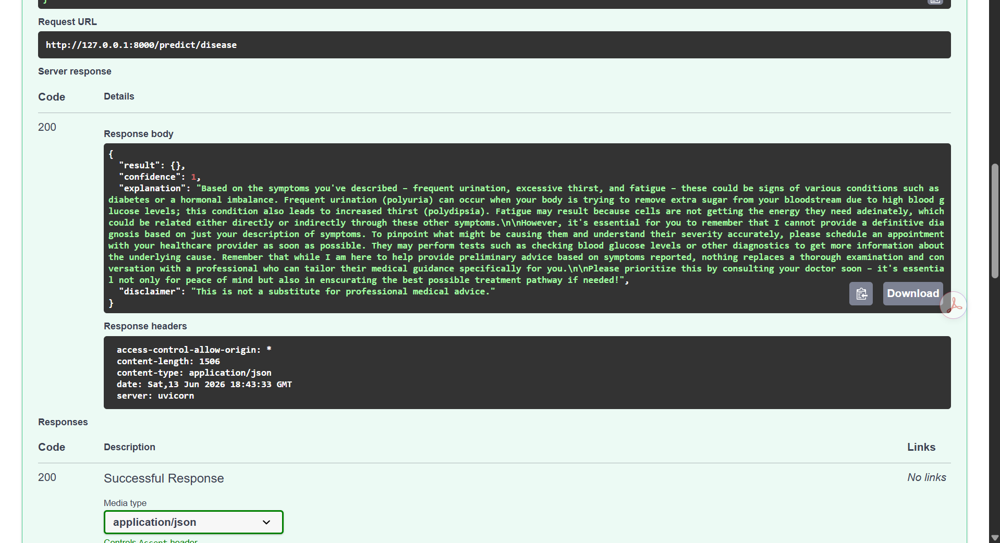
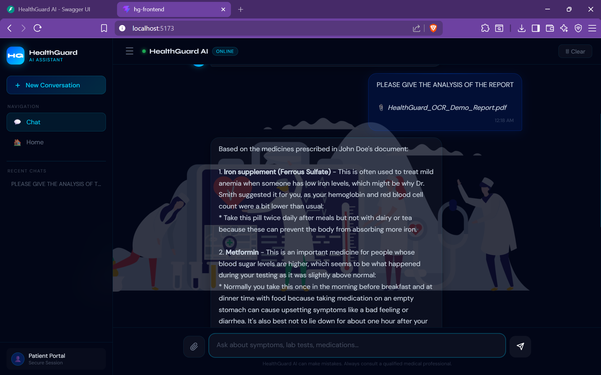
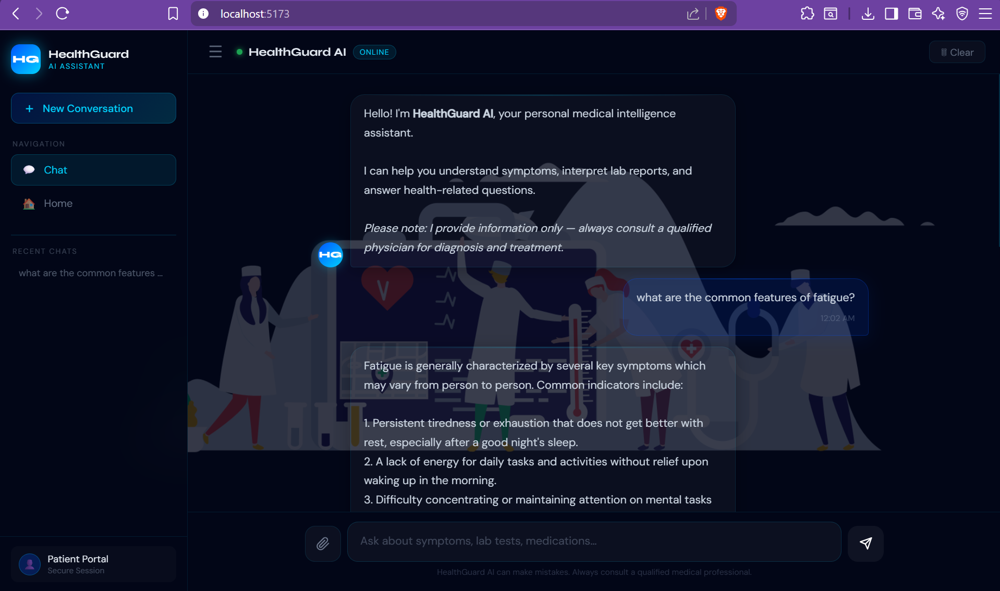
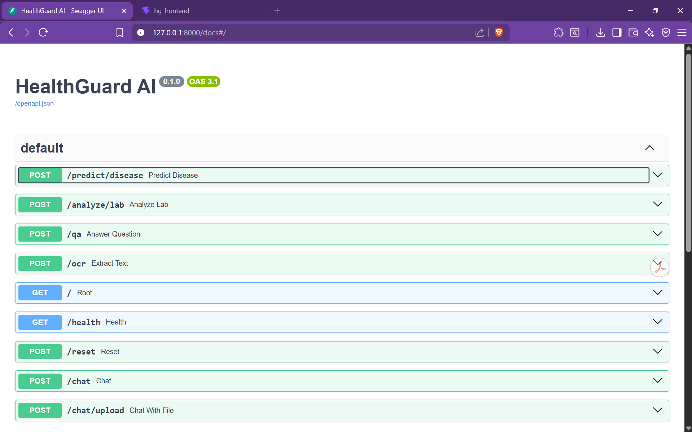
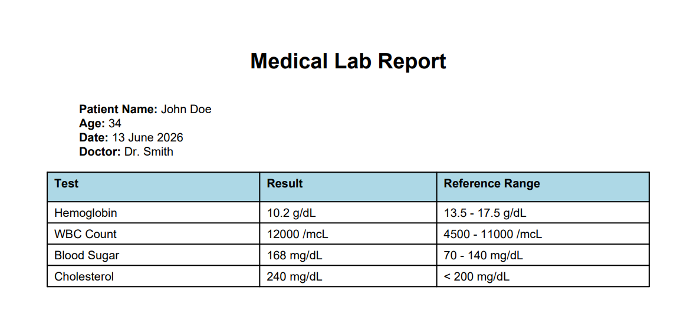

# 🏥 HealthGuard AI — Intelligent Medical Assistant System

🎥 [Watch Demo Video](https://youtu.be/fx8s1pgH0Mw)

An intelligent medical AI system that helps users understand symptoms, interpret lab reports, read prescriptions, and get answers to medical questions — all in one place.

---

## 📸 Platform Preview



HealthGuard AI combines OCR, NLP, Retrieval-Augmented Generation (RAG), disease prediction, and local LLM orchestration into a unified healthcare intelligence platform designed to simplify complex medical information into explainable and accessible insights.

---

## 🚀 Features

* 🤒 **Disease Predictor** — Detects possible conditions from symptoms using a fine-tuned BioBERT model trained on 770+ diseases
* 🧪 **Lab Analyzer** — Interprets blood test results and flags abnormal values with explanations
* 💊 **Prescription Reader** — Reads handwritten and printed prescriptions using EasyOCR and summarizes them in simple language
* ❓ **Medical Q&A** — Answers health questions using a FAISS-indexed medical knowledge base
* 🤖 **LLM Integration** — Uses Ollama (phi3:mini) locally for natural language responses

---

## 🧠 AI Feature Demonstrations

### 🤒 Disease Prediction Input



### ✅ Disease Prediction Output



### 🧾 OCR-Based Medical Report Analysis



### ❓ AI Medical Question Answering



### ⚙️ FastAPI Swagger Backend Interface



---

## 🧩 System Overview

HealthGuard AI follows a modular AI architecture consisting of:

* **Frontend Layer** — React + Vite interface for user interaction
* **Backend Layer** — FastAPI-powered API orchestration
* **AI Inference Layer** — BioBERT, Sentence Transformers, OCR pipelines, and local LLM inference
* **Retrieval Layer** — FAISS-powered medical knowledge retrieval
* **LLM Layer** — Ollama-hosted lightweight language models for contextual responses

The platform is designed with a strong focus on:

* Explainable AI
* Privacy-focused local inference
* Healthcare accessibility
* Modular AI orchestration

---

## 🧠 Model Weights

The trained BioBERT disease predictor model (~415MB) is hosted on Google Drive:

📥 **[Download disease_predictor.pt](https://drive.google.com/file/d/1DSAOwZ-t40kSIbiiog55peYYXJ6FTFtQ/view?usp=sharing)**

After downloading, place it here:

```bash
models/saved_weights/disease_predictor.pt
```

---

## 🛠️ Tech Stack

| Layer         | Technology                       |
| ------------- | -------------------------------- |
| Frontend      | React + Vite                     |
| Backend       | FastAPI (Python)                 |
| Disease Model | BioBERT (fine-tuned)             |
| OCR           | EasyOCR                          |
| LLM           | Ollama — phi3:mini               |
| QA Engine     | FAISS + SentenceTransformers     |
| Lab Analyzer  | Rule-based with reference ranges |

---

## ⚙️ Setup & Installation

### Prerequisites

* Python 3.10+
* Node.js 18+
* [Ollama](https://ollama.com) installed

---

### 1. Clone the Repository

```bash
git clone https://github.com/riyasirohi25/HealthGuard-AI.git
cd healthguard-ai
```

---

### 2. Create Virtual Environment

```bash
python -m venv venv
```

#### Windows

```bash
venv\Scripts\activate
```

#### Mac/Linux

```bash
source venv/bin/activate
```

---

### 3. Install Python Dependencies

```bash
pip install -r requirements.txt
```

---

### 4. Download Model Weights

Download `disease_predictor.pt` from the link above and place it inside:

```bash
models/saved_weights/disease_predictor.pt
```

---

### 5. Pull Ollama Model

```bash
ollama pull phi3:mini
```

---

### 6. Install Frontend Dependencies

```bash
cd hg-frontend
npm install
cd ..
```

---

## ▶️ Running the Project

### Terminal 1 — Start Ollama

```bash
ollama serve
```

---

### Terminal 2 — Start Backend

```bash
python -m uvicorn api.main:app --reload
```

---

### Terminal 3 — Start Frontend

```bash
cd hg-frontend
npm run dev
```

Then open:

```bash
http://localhost:5173
```

---

## 🎬 Live Demo Preview

### 🏥 Frontend Dashboard


### 📄 Sample OCR Medical Report



---

## 🧪 Example Inputs to Test

### Symptoms

```text
I have fever, sore throat, cough and runny nose since 3 days
```

### Lab Test

```text
my hemoglobin is 9.5
```

```text
my glucose_fasting is 280
```

### Medical Question

```text
What are common causes of fatigue?
```

### Prescription

Upload any prescription image via the chat interface.

---

## 📁 Project Structure

```bash
healthguard-ai/
├── api/              # FastAPI routes and main app
├── config/           # Configuration files
├── core/             # Orchestrator logic
├── hg-frontend/      # React frontend
├── llm/              # Ollama client
├── models/           # ML models (BioBERT, Lab Analyzer, QA Engine)
├── notebooks/        # Training notebooks
├── scripts/          # Data cleaning and preprocessing scripts
├── tests/            # Unit tests
└── requirements.txt
```

---

## 📓 Model Training

The disease predictor was trained on Kaggle using a T4 GPU due to local RAM constraints.

Training achieved approximately **81.6% validation accuracy** over 5 epochs on a dataset containing 770+ disease classes.

---

## 🌍 Real-World Impact

HealthGuard AI is designed to improve healthcare accessibility by simplifying complex medical information through AI-powered analysis and explainable healthcare intelligence.

The platform aims to support:

* Early health awareness
* Simplified medical understanding
* Accessible healthcare assistance
* Privacy-focused local AI inference
* AI-assisted healthcare guidance
* Healthcare support for underserved communities

---

## ⚠️ Disclaimer

HealthGuard AI is for informational purposes only. It is **not a substitute for professional medical advice**. Always consult a qualified physician for diagnosis and treatment.

---

## 👥 Team & Contributions

This project was developed collaboratively as part of a team.

### 👩‍💻 My Contributions (Riya Sirohi)

* Fine-tuned BioBERT disease classification model on 770+ disease categories.
* Designed and implemented the FAISS-based retrieval pipeline for medical question answering.
* Built OCR-based prescription analysis workflow using EasyOCR.
* Developed the local LLM orchestration layer using Ollama and phi3.
* Implemented FastAPI backend services and AI model integration.

---

## 🤝 Original Repository

Original Repository:
https://github.com/Shagunnn25/healthguard-ai

---

## 👩‍💻 Built By

* Chahak Porwal
* Mumal Singh
* Riya Sirohi
* Shagun Mogha

— HealthGuard AI Project

---

## 🎥 Project Demonstration

Watch Full Demo:
https://youtu.be/fx8s1pgH0Mw
